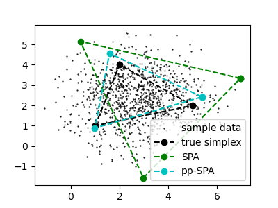

# Improved Algorithm and Bounds for Successive Projection

## Problem Setup

Given noisy observations from a (K-1)-dimensional simplex in d-dimensions, the goal of vertex hunting is to recover the K vertices of the simplex. We propose a new approach called Pseudo-point SPA (ppSPA), which leverages a projection step together with a KNN denoise step to improve on the traditional SPA. Our method performs better in practice and yields sharper and faster theoretical bounds.





## Reproducing Experiments

To reproduce the experiments from our paper, run:

```bash
python experiments.py
```

For more details, refer to our [ICLR 2024 paper](link-to-paper) and [code repository](https://github.com/Gabriel78110/VertexHunting/tree/main).

